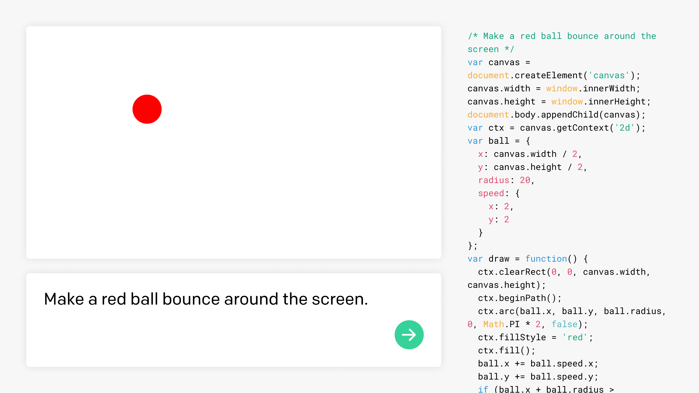

# **代码补全** (有限地测试中)
学习如何生成或操作代码

## **介绍**
[Codex系列模型](https://platform.openai.com/docs/models/codex)是基于我们的[GPT-3系列模型](https://platform.openai.com/docs/models/base-series)，并且已经同时经过自然语言和百万行代码的训练。它最擅长Python并且熟练十几种语言包括Javascript、Go、Perl、PHP、Ruby、Swift、TypeScript、SQL甚至是Shell。在最初有限测试的期间，Codex的可以免费使用。[了解更多](https://platform.openai.com/docs/models/codex)

你可以使用Codex来完成多种任务，包括：
- 将注释转换成代码
- 基于上下文完成你的下一行或者function
- 增长你的知识面，比如为应用找到合适的库或者API调用
- 添加注释
- 重构代码以提高效率

想看看Codex的实际操作，可以查看我们的[Codex Javascript沙盒](https://platform.openai.com/codex-javascript-sandbox)或者我们其他的[示例视频](https://www.youtube.com/playlist?list=PLOXw6I10VTv_FhQbbvYh1FvbiaPf43Ve2)。



## **快速开始**

开始自己使用Codex，在[在线编辑器](https://platform.openai.com/playground)中打开这个示例。

### **说“Hello”（Python）**
```Python
"""
询问用户的名字并说Hello
"""
```
[在线编辑器中打开](https://platform.openai.com/playground?model=code-davinci-002&prompt=%22%22%22%0AAsk%20the%20user%20for%20their%20name%20and%20say%20%22Hello%22%0A%22%22%22)

### **创建一个随机的名字（Python）**
```Python
"""
1. 创建一个名字的列表
2. 创建一个姓的列表
3. 将他们随机组合成有100个完整名字的列表
"""
```
[在线编辑器中打开](https://platform.openai.com/playground?model=code-davinci-002&prompt=%22%22%22%0A1.%20Create%20a%20list%20of%20first%20names%0A2.%20Create%20a%20list%20of%20last%20names%0A3.%20Combine%20them%20randomly%20into%20a%20list%20of%20100%20full%20names%0A%22%22%22)

### **创建一个MySql的查询语句（Python）**
```Python
"""
表格名为customers，列 = [CustomerId, FirstName, LastName, Company, Address, City, State, Country, PostalCode, Phone, Fax, Email, SupportRepId]
为所有在得克萨斯州名为Jane的顾客创建一个SQL查询
"""
query = 
```
[在线编辑器中打开](https://platform.openai.com/playground?model=code-davinci-002&prompt=%22%22%22%0ATable%20customers%2C%20columns%20%3D%20%5BCustomerId%2C%20FirstName%2C%20LastName%2C%20Company%2C%20Address%2C%20City%2C%20State%2C%20Country%2C%20PostalCode%2C%20Phone%2C%20Fax%2C%20Email%2C%20SupportRepId%5D%0ACreate%20a%20MySQL%20query%20for%20all%20customers%20in%20Texas%20named%20Jane%0A%22%22%22%0Aquery%20%3D)

### **解释代码（JavaScript）**
```javascript
// Function 1
var fullNames = [];
for (var i = 0; i < 50; i++) {
  fullNames.push(names[Math.floor(Math.random() * names.length)]
    + " " + lastNames[Math.floor(Math.random() * lastNames.length)]);
}

// Function 1 做了什么？
```
[在线编辑器中打开](https://platform.openai.com/playground?model=code-davinci-002&prompt=%2F%2F%20Function%201%0Avar%20fullNames%20%3D%20%5B%5D%3B%0Afor%20%28var%20i%20%3D%200%3B%20i%20%3C%2050%3B%20i%2B%2B%29%20%7B%0A%20%20fullNames.push%28names%5BMath.floor%28Math.random%28%29%20%2A%20names.length%29%5D%0A%20%20%20%20%2B%20%22%20%22%20%2B%20lastNames%5BMath.floor%28Math.random%28%29%20%2A%20lastNames.length%29%5D%29%3B%0A%7D%0A%0A%2F%2F%20What%20does%20Function%201%20do%3F)

### **更多示例**
访问我们的[示例库](https://platform.openai.com/examples?category=code)，探索更多为Codex设计的功能。

## **最佳实践**
从一句注释、数据或代码开始。你可以在我们的在线编辑器中尝试使用任一Codex模型（再需要的时候将指令作为注释）。

为了让Codex更好地进行补全，我们需要思考程序员在完成任务时需要哪些信息。这可能只是一个清晰的注释或者写一个有用的function所需要的数据，如变量名名或者是处理function的类。

```python
 创建一个名为‘nameImporter’的function，来将姓和名存入到数据库中
```
[在线编辑器中打开](https://platform.openai.com/playground?model=code-davinci-002&prompt=%23%20Create%20a%20function%20called%20%27nameImporter%27%20to%20add%20a%20first%20and%20last%20name%20to%20the%20database)

在这个例子中，我们告诉Codex要调用的function以及他将要执行的任务。

这种方式你甚至可以给Codex提供注释和数据库的样例schema，让它为各种数据库写一些有用的查询请求。
```python
 Table albums, columns = [AlbumId, Title, ArtistId]
 Table artists, columns = [ArtistId, Name]
 Table media_types, columns = [MediaTypeId, Name]
 Table playlists, columns = [PlaylistId, Name]
 Table playlist_track, columns = [PlaylistId, TrackId]
 Table tracks, columns = [TrackId, Name, AlbumId, MediaTypeId, GenreId, Composer, Milliseconds, Bytes, UnitPrice]

 为所有阿黛尔的专辑创建一个查询
```
[在线编辑器中打开](https://platform.openai.com/playground?model=code-davinci-002&prompt=%23%20Table%20albums%2C%20columns%20%3D%20%5BAlbumId%2C%20Title%2C%20ArtistId%5D%0A%23%20Table%20artists%2C%20columns%20%3D%20%5BArtistId%2C%20Name%5D%0A%23%20Table%20media_types%2C%20columns%20%3D%20%5BMediaTypeId%2C%20Name%5D%0A%23%20Table%20playlists%2C%20columns%20%3D%20%5BPlaylistId%2C%20Name%5D%0A%23%20Table%20playlist_track%2C%20columns%20%3D%20%5BPlaylistId%2C%20TrackId%5D%0A%23%20Table%20tracks%2C%20columns%20%3D%20%5BTrackId%2C%20Name%2C%20AlbumId%2C%20MediaTypeId%2C%20GenreId%2C%20Composer%2C%20Milliseconds%2C%20Bytes%2C%20UnitPrice%5D%0A%0A%23%20Create%20a%20query%20for%20all%20albums%20by%20Adele)

当你向Codex展示一个数据库的schema时，它可以有依据地猜测出如何去格式化查询。

**指明语言**。Codex掌握十几种编程语言，许多语言在注释、函数或编程语法有类似的约定。通过在注释中指明语言和版本，Codex可以更好的为你提供想要的代码补全能力，Codex在风格和语法上相当灵活。

```python
 R语言
 计算点数组之间的平均距离
```
[在线编辑器中打开](https://platform.openai.com/playground?model=code-davinci-002&prompt=%23%20R%20language%0A%23%20Calculate%20the%20mean%20distance%20between%20an%20array%20of%20points)

```python
 Python
 计算点数组之间的平均距离
```
[在线编辑器中打开](https://platform.openai.com/playground?model=code-davinci-002&prompt=%23%20Python%203%0A%23%20Calculate%20the%20mean%20distance%20between%20an%20array%20of%20points)

***提示Codex你想要它做什么***。如果你想Codex创建一个网页，在你告诉它要做什么的注释之后，放一个在Html文档（`<!DOCTYPE html>`）的第一行代码。
```html
<!-- 创建一个网页，title为'Kat Katman attorney at paw' -->
<!DOCTYPE html>
```
[在线编辑器中打开](https://platform.openai.com/playground?model=code-davinci-002&prompt=%3C%21--%20Create%20a%20web%20page%20with%20the%20title%20%27Kat%20Katman%20attorney%20at%20paw%27%20--%3E%0A%3C%21DOCTYPE%20html%3E)

在我们的注释之后放一个`<!DOCTYPE html>`，可以让Codex明确知道我们想要它做什么。
```python
 创建一个数到100的函数

def counter
```
[在线编辑器中打开](https://platform.openai.com/playground?model=code-davinci-002&prompt=%23%20Create%20a%20function%20to%20count%20to%20100%0A%0Adef%20counter)


如果我们开始写函数，Codex将会明白接下来它将需要干什么。

**指明函数库可以让Codex明白你想要什么**。Codex知道大量的库、API或者model。通过告诉Codex使用哪一个，不论是用注释或者直接在代码中导入的方式，Codex将会在此基础上提出建议而不是替代方案。
```html
<!-- 使用版本为1.2.0的A-Frame库，创建一个3D到网站 -->
<!-- https://aframe.io/releases/1.2.0/aframe.min.js -->
```
通过指明版本，你可以确保Codex使用最新的库。

提示：Codex可以建议有用的库或则API，但你需要自己再去调研下以确保它们对你应用来说是安全的。

**注释风格会影响代码质量**。在某些语言中，注释的风格可以提升输出的质量。例如，当使用Python时，在某些情况下，使用doc字符串注释（用三引号括起来）可以比通过使用井号(#)注释提供更高质量的结果。
```python
"""
创建一个用户和邮箱地址的数组
"""
```
[在线编辑器中打开](https://platform.openai.com/playground?model=code-davinci-002&prompt=%22%22%22%0ACreate%20an%20array%20of%20users%20and%20email%20addresses%0A%22%22%22)

**在函数中添加注释会很有帮助**。推荐的编码标准通常建议将函数的注释放在其内部。使用这种格式可以让Codex更清楚地知道你想要这个函数做什么。
```python
def getUserBalance(id):
    """
    Look up the user in the database ‘UserData' and return their current account balance.
    """
```
[在线编辑器中打开](https://platform.openai.com/playground?model=code-davinci-002&prompt=def%20getUserBalance%28id%29%3A%0A%20%20%20%20%22%22%22%0A%20%20%20%20Look%20up%20the%20user%20in%20the%20database%20‘UserData%27%20and%20return%20their%20current%20account%20balance.%0A%20%20%20%20%22%22%22)

**提供示例来获取更精准的结果**。如果你需要Codex去使用特别的风格或者格式，在第一部份提供例子或者示范它能让Codex更精准地了解你想要的。
```python
"""
创建一个随机动物和物种的列表
"""
animals  = [ {"name": "Chomper", "species": "Hamster"}, {"name":
```
[在线编辑器中打开](https://platform.openai.com/playground?model=code-davinci-002&prompt=%22%22%22%0ACreate%20a%20list%20of%20random%20animals%20and%20species%0A%22%22%22%0Aanimals%20%20%3D%20%5B%20%7B%22name%22%3A%20%22Chomper%22%2C%20%22species%22%3A%20%22Hamster%22%7D%2C%20%7B%22name%22%3A)

...
# 待更新完成

<br/>
<br/>
<br/>
<br/>

# 图像生成

...
# 待更新完成