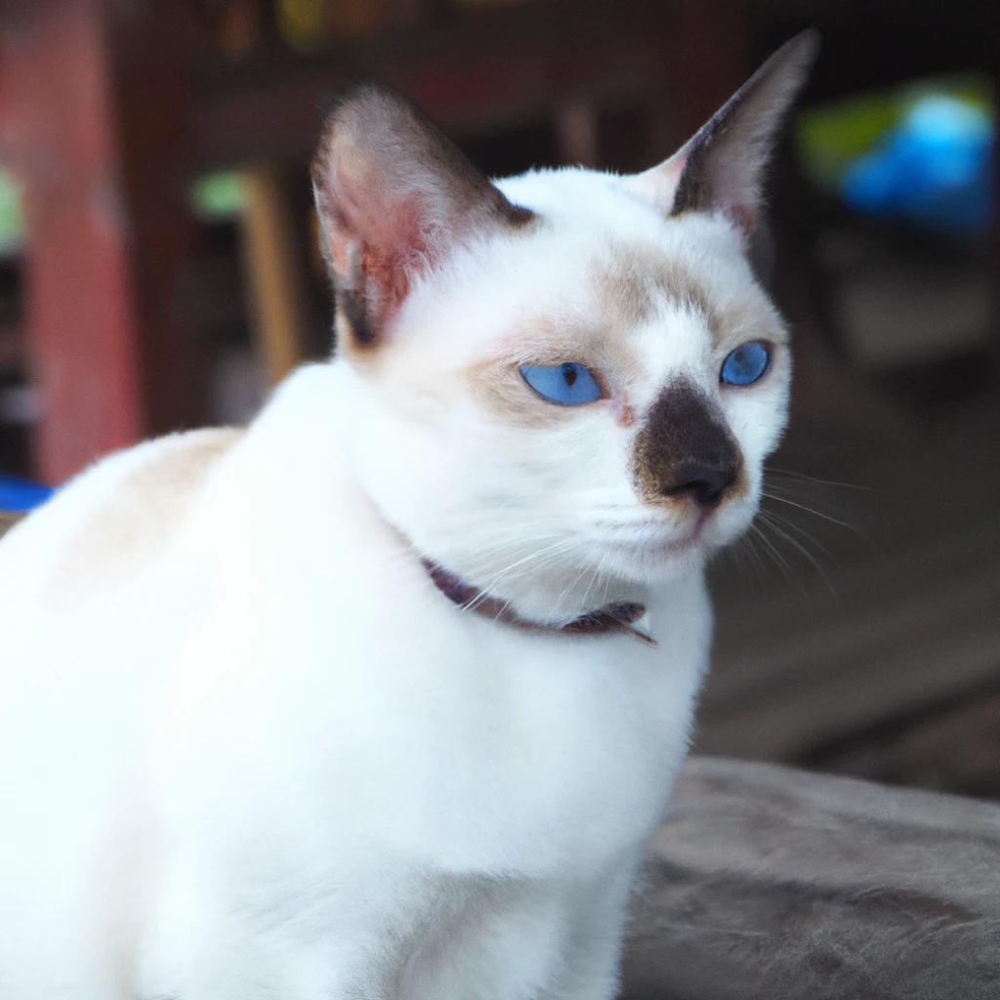
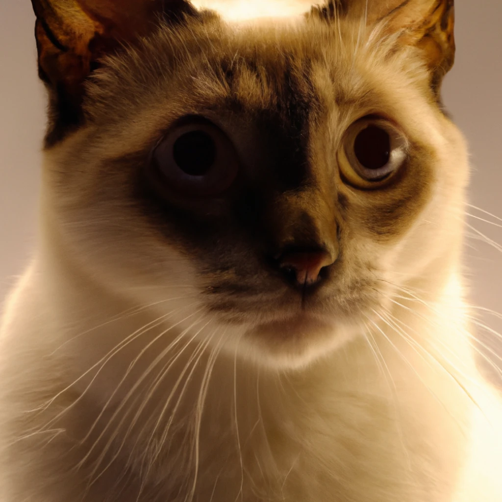

# **图像生成** <span style="font-weight: bold;font-size: 12px;line-height: 13px;background: #d2f4d3;color: #1a7f64;padding: 2px 4px 1px;border-radius: 3px;white-space: nowrap;display: inline-block;vertical-align: middle;margin-left: 12px;">测试</span>

学习如何通过 DALL·E 模型 生成或操作图像。

## **介绍**

图像 API 提供了三种与图像交互的方法：

- 基于文本提示从头开始创建图像
- 基于新的文本提示创建图像的编辑
- 创建已有图像的变体

这个指引通过有用的代码示例，覆盖了三个 API 的基础用法。想要看它们的行为，点击我们的 [ DALL·E 预览 APP](https://labs.openai.com/)。

> 这个图像 API 处于测试状态，在此期间 API 和模型会基于你的反馈而进化。为了确保所有的用户能够用得舒适，默认设置了每分钟 50 张图片的生成上限。如果你想要增加你的上限，请查看这个[帮助中心文章](https://help.openai.com/en/articles/6696591)。我们会在了解到有更多用量和容量需求后提高默认速率限制。

## **使用**

### **生成 ( Generations )**

图像生成接口让你能够通过提供文本提示，创建一个原创的图像。生成的图像支持这几种像素规格 256x256, 512x512, 或 1024x1024。规格越小生成得越快，你可以通过设置 [`n`](<../API参考/图像(Images).md#image/n>) 参数一次性请求 1 到 10 张图片。

```bash
# Curl
curl https://api.openai.com/v1/images/generations \
  -H 'Content-Type: application/json' \
  -H "Authorization: Bearer $OPENAI_API_KEY" \
  -d '{
    "prompt": "a white siamese cat",
    "n": 1,
    "size": "1024x1024"
  }'
```

```JavaScript
// JavaScript
const response = await openai.createImage({
  prompt: "a white siamese cat",
  n: 1,
  size: "1024x1024",
});
image_url = response.data.data[0].url;
```

```Python
# Python
response = openai.Image.create(
  prompt="a white siamese cat",
  n=1,
  size="1024x1024"
)
image_url = response['data'][0]['url']
```

描述写的越详细，获取到的图片就越接近你或者你终端用户想要的样子。你可以在 [ DALL·E 预览 APP](https://labs.openai.com/) 中索更多例子来触发灵感。这里有几个例子：

| **提示词**                                                                     | **英语原文**                                                                                     | **生成的图片**                      |
| ------------------------------------------------------------------------------ | ------------------------------------------------------------------------------------------------ | ----------------------------------- |
| 一只白色的暹罗猫                                                               | a white siamese cat                                                                              |  |
| 一只白色的暹罗猫的摄影棚风的的近距离照，它看起来很好奇并且有光从它的耳朵处透过 | a close up, studio photographic portrait of a white siamese cat that looks curious, backlit ears |  |

可以通过 [`response_format`](<../API参考/图像(Images).md#image/ response_format>) 参数，让每张图片作为 URL 或者 Base64 的数据格式返回。

## **编辑**

[图像生成](<../API参考/图像(Images).md#创建图片编辑--测试版-->)编辑接口允许您通过上传蒙层来编辑和扩展图像。透明的蒙层区域指明需要被编辑的图像，并且提示文本必须完整描述整个新的图像，**而不仅仅是被擦掉的区域**。这个接口可以实现像[DALL·E 预览 APP](https://labs.openai.com/editor) 中的编辑器那样的体验。

```bash
# Curl
curl https://api.openai.com/v1/images/edits \
  -H "Authorization: Bearer $OPENAI_API_KEY" \
  -F image='@sunlit_lounge.png' \
  -F mask='@mask.png' \
  -F prompt="A sunlit indoor lounge area with a pool containing a flamingo" \
  -F n=1 \
  -F size="1024x1024"
```

```JavaScript
// Node.js
const response = await openai.createImageEdit(
  fs.createReadStream("sunlit_lounge.png"),
  fs.createReadStream("mask.png"),
  "A sunlit indoor lounge area with a pool containing a flamingo",
  1,
  "1024x1024"
);
image_url = response.data.data[0].url;
```

```Python
# Python
response = openai.Image.create_edit(
  image=open("sunlit_lounge.png", "rb"),
  mask=open("mask.png", "rb"),
  prompt="A sunlit indoor lounge area with a pool containing a flamingo",
  n=1,
  size="1024x1024"
)
image_url = response['data'][0]['url']
```

| 图像                              | 蒙层                              | 输出                              |
| --------------------------------- | --------------------------------- | --------------------------------- |
|  |  |  |

> 提示词: 在阳光充足的室内休息区的游泳池内有一只火烈鸟

上传的图片和蒙层必须都是小于 4MB 的正方形 PNG 图片，同时彼此必须都是相同的尺寸。而在生成输出的时候，蒙层的非透明区域不会参与，所以实际上不需要像例子中的蒙层一样，与图像一致。

## **变化**

图像变化的接口能够为你提供的图片生成一个变体。

```bash
# Curl
curl https://api.openai.com/v1/images/variations \
  -H "Authorization: Bearer $OPENAI_API_KEY" \
  -F image='@corgi_and_cat_paw.png' \
  -F n=1 \
  -F size="1024x1024"
```

```JavaScript
// Node.js
const response = await openai.createImageVariation(
  fs.createReadStream("corgi_and_cat_paw.png"),
  1,
  "1024x1024"
);
image_url = response.data.data[0].url;
```

```Python
# Python
response = openai.Image.create_variation(
  image=open("corgi_and_cat_paw.png", "rb"),
  n=1,
  size="1024x1024"
)
image_url = response['data'][0]['url']
```

| 图片                              | 输出                              |
| --------------------------------- | --------------------------------- |
|  |  |

和编辑接口一样，输入必须是小于 4MB 的正方形 PNG 格式的图片。

## 内容审核
输入的提示文本和图片都会基于我们的[内容策略](https://labs.openai.com/policies/content-policy)进行过滤，当提示文本或图片被标记过时会返回一个错误。如果您对误报或相关问题有任何反馈，请通过我们的[帮助中心](https://help.openai.com/)与我们联系。


## **特定的语言技巧**

1. [Node.js](#nodejs)
2. [Python](#python)

### **Node.js**
#### **# 使用内存中的图像数据**
在前面内容的 Node.js 的例子中，我们通过使用 `fs` 模块从硬盘中读取图像数据。在一些情况下，你的图像数据可能是保存在内存中的。下面是一个使用存储在 Node.js `Buffer` 对象中的图像数据的API调用示例:
```JavaScript
// 这是一个存放图像数据的 Buffer 对象
const buffer = [your image data];
// 在名字最后加上 .png 以便让 API 知道这是一个 PNG 图片
buffer.name = "image.png";
const response = await openai.createImageVariation(
  buffer,
  1,
  "1024x1024"
);
```

#### **# 使用的是 TypeScript**
如果你在用的是 TypeScript，你可能会遇到一些奇怪的图像文件参数。下面是一个通过显式强制转换实参来解决类型不匹配的示例:
```TypeScript
// 将 ReadStream 转换为 any 以适配 TypeScript 编译器
const response = await openai.createImageVariation(
  fs.createReadStream("image.png") as any,
  1,
  "1024x1024"
);
```
下面是一个使用内存中的图像数据的例子
```TypeScript
// 这是一个存放图像数据的 Buffer 对象
const buffer: Buffer = [your image data];
// 将 Buffer 转换为 any 以便我们可以设置 name 属性
const file: any = buffer;
// 在名字最后加上 .png 以便让 API 知道这是一个 PNG 图片
file.name = "image.png";
const response = await openai.createImageVariation(
  file,
  1,
  "1024x1024"
);
```

#### **# 异常处理**
API 可能因为不合法的输入、频率限制或其他问题而返回错误。这些错误可以通过 `try...catch` 语法进行捕获，并且错误详情可以通过 `error.response` 或 `error.message` 获取。
```TypeScript
try {
  const response = await openai.createImageVariation(
    fs.createReadStream("image.png"),
    1,
    "1024x1024"
  );
  console.log(response.data.data[0].url);
} catch (error) {
  if (error.response) {
    console.log(error.response.status);
    console.log(error.response.data);
  } else {
    console.log(error.message);
  }
}
```

### Python
#### **# 使用内存中的图像数据**
在前面内容的 Python 的例子中，我们通过使用 `open` 函数从硬盘中读取图像数据。在一些情况下，你的图像数据可能是保存在内存中的。下面是一个使用存储在 `BytesIO` 对象中的图像数据的API调用示例:

```Python
from io import BytesIO
# 这是一个存放图像数据的 BytesIO 对象
byte_stream: BytesIO = [your image data]
byte_array = byte_stream.getvalue()
response = openai.Image.create_variation(
  image=byte_array,
  n=1,
  size="1024x1024"
)
```
#### **# 对图像进行处理**
最好在把图像传给 API 之前对它进行处理。下面的例子用 `PIL` 来调整图像的尺寸。
```Python
from io import BytesIO
from PIL import Image

# 从硬盘上的文件读取图像并调整它的尺寸
image = Image.open("image.png")
width, height = 256, 256
image = image.resize((width, height))

# 将图像转换为 BytesIO 对象
byte_stream = BytesIO()
image.save(byte_stream, format='PNG')
byte_array = byte_stream.getvalue()

response = openai.Image.create_variation(
  image=byte_array,
  n=1,
  size="1024x1024"
)
```
#### **# 异常处理**
API 可能因为不合法的输入、频率限制或其他问题而返回错误。这些错误可以通过 `try...catch` 语法进行捕获，并且错误详情可以通过 `e.error` 获取。

```Python
try:
  openai.Image.create_variation(
    open("image.png", "rb"),
    n=1,
    size="1024x1024"
  )
  print(response['data'][0]['url'])
except openai.error.OpenAIError as e:
  print(e.http_status)
  print(e.error)
```
